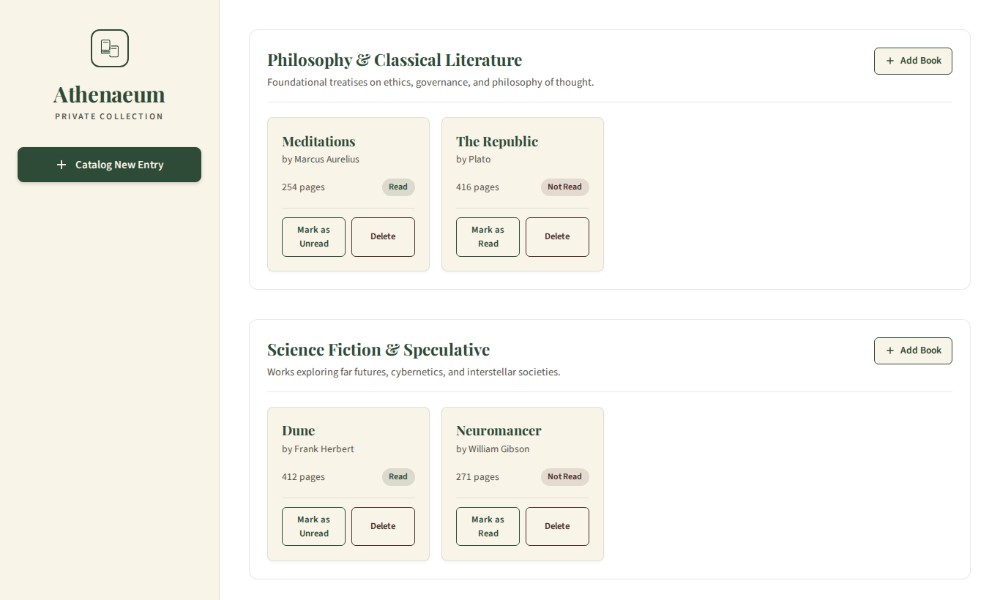

# 🏛️ Athenaeum — Private Collection Library

A sophisticated, category-based library management web application built as part of **The Odin Project** curriculum. It demonstrates core **Object-Oriented Programming (OOP)** principles in vanilla JavaScript using constructor functions, prototype-based inheritance, and dynamic DOM rendering.



---

## ✨ Features

- **Categorized Shelves (Estantes Dinámicos):**
  - Create distinct categories/shelves (e.g., *Philosophy & Classical Literature*, *Science Fiction*).
  - Each shelf maintains its own collection of books and includes an empty-state indicator when no books are present.

- **Book Management (CRUD):**
  - Add books directly to a specific shelf.
  - Track book metadata: Title, Author, Number of Pages, and Reading Status.
  - Toggle reading status (*Read* / *Not Read*) on the fly.
  - Delete individual books with instant DOM updates.

- **Accessible & Clean Modal System:**
  - Distinct modal workflows for creating Categories and adding Books.
  - Close modals via Close button (`×`), `Cancel` button, clicking the backdrop, or pressing the `Escape` key.
  - Automatic focus management on inputs when opening modals.

- **Refined Editorial Aesthetic:**
  - Inspired by classic study systems and private archival collections.
  - Custom color palette, CSS Grid/Flexbox layouts, fluid typography (*Playfair Display* & *Source Sans 3*), and responsive UI.

---

## 🧠 Object-Oriented Architecture (OOP)

The application utilizes JavaScript constructor functions and prototypes to establish a clear **composition** relationship between categories and books:

```
State (categories array)
 └── Category Instance (id, name, description, books[])
      ├── Category.prototype.addBook(book)
      ├── Category.prototype.removeBook(bookId)
      └── Book Instances (id, title, author, pages, read, categoryId)
           └── Book.prototype.toggleRead()
```

### Key Entities:

- **`Category(id, name, description)`**:
  - `addBook(book)`: Adds a book to the shelf's internal `books` collection.
  - `removeBook(bookId)`: Filters out the book by its unique ID.

- **`Book(id, title, author, pages, read, categoryId)`**:
  - `toggleRead()`: Flips the boolean `read` status between `true` and `false`.

---

## 🛠️ Built With

- **HTML5**: Semantic elements and structured modal dialogs.
- **CSS3**: CSS Custom Properties (variables), Flexbox, CSS Grid, and responsive design.
- **Vanilla JavaScript (ES6+)**: Constructor functions, Prototypal inheritance, DOM manipulation, and event handling.

---

## 🚀 Getting Started

No build tools or package managers required. Simply clone and open in any modern browser:

1. Clone the repository:
   ```bash
   git clone https://github.com/joacoContreras/Library.git
   ```
2. Open `index.html` in your web browser:
   ```bash
   # On Linux:
   xdg-open index.html

   # On macOS:
   open index.html
   ```

---

## 📚 Acknowledgements

- Project prompt by [The Odin Project](https://www.theodinproject.com/).
- Fonts by [Google Fonts](https://fonts.google.com/) (*Playfair Display* and *Source Sans 3*).